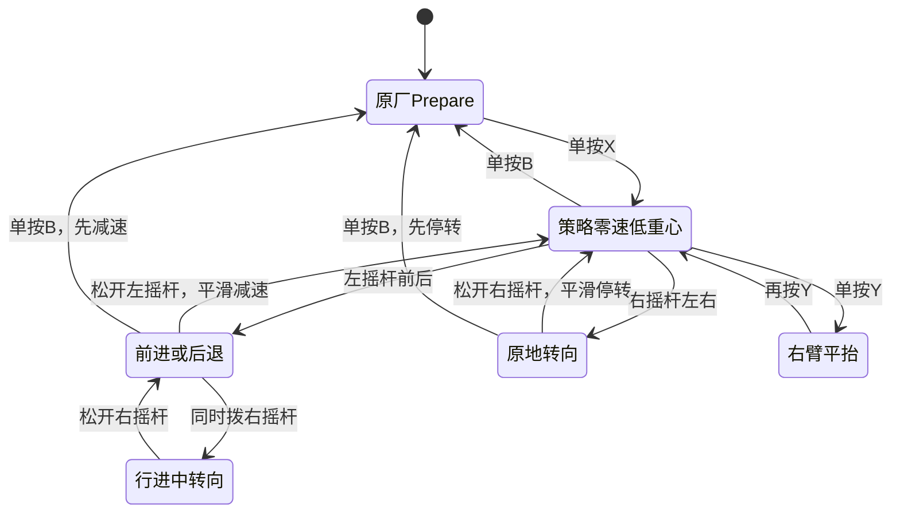

# T1 S62 比赛控制器

这是当前可部署版本。压缩包内含 S62 第 1000 轮模型、80→21→23 关节适配、比赛手柄状态机、常驻服务、一键安装与回退脚本。

## 一键部署

把 ZIP 复制到机器人感知板并解压，然后只执行：

```bash
cd T1_S62_COMPETITION_DEPLOY
sudo bash install_s62.sh
```

安装脚本会先核对模型哈希、80 维观察、21 维动作和 23 关节映射，再安装并启动 `t1-s62-competition.service`。程序由 systemd 常驻，SSH 或网线断开不会停止手柄控制。它只停用旧的 `t1-s46.service`，不覆盖原厂 Booster 程序。

需要退出本控制器时执行：

```bash
sudo bash rollback_s62.sh
```

## 手柄状态机



- `X`：一次进入 Custom，模型从当前关节目标用 1.5 秒平滑接管并进入零速低重心姿态。姿态稳定前摇杆命令会被屏蔽。
- `A`：空闲，不参与步态。
- 左摇杆前后：前进、后退。速度命令限制加速度和加加速度，松杆后仍留在策略零速姿态。
- 右摇杆左右：原地转向或行进中修正。角速度使用独立的加速度和加加速度限制。
- `Y`：只在零速时平滑切换右肩俯仰到 −1.57 rad，不改变步态状态。
- `B`：先把行走和转向命令降到零，稳定后回原厂 Prepare；常驻服务继续等待下一次 `X`。
- 按住 `LT` 或 `RT` 时，`X/A/B/Y` 保留给原厂组合键，不触发自定义单键。

控制器参数：前进最大 1.6 m/s、后退最大 1.0 m/s、转向最大 0.5 rad/s；前进加速度上限 0.5 m/s²、加加速度上限 1.5 m/s³；转向角加速度上限 0.4 rad/s²、角加加速度上限 1.2 rad/s³。

## S62 模型

模型：`ClearanceHoldSpeed S62` 第 1000 轮。TorchScript SHA256：`6cf343cd70a59156ee1e25655754acda0a067b62907b7c1b211e3763fd8f066f`。

固定 1.6 m/s、60 秒仿真：实速 1.382 m/s、横漂 +0.014 m、力矩请求触限 5.2%、关节速度触限 0%、步幅 0.794 m、步频 1.734 Hz、摆脚边缘离地 13.2 mm。动态序列 31/32，四向推扰 128/128。

原地转向固定测试均走满：命令 −1.0/−0.4/+0.4/+1.0 rad/s 时，实测约 −0.842/−0.224/+0.133/+0.777 rad/s。它已经能用，但仍是当前最需要继续增强的模型能力，尤其是小幅右转响应和动态序列中的转向存活率。

## 交接人现场步骤

1. 机器人固件使用已验证的 v1.8.0.9，机身急停已弹起，电池锁扣和关节线束可靠固定。
2. 运行上面的安装命令，看到服务为 `active (running)`。
3. 用原厂按键进入 Prepare。
4. 单按 `X`，等待约 2 秒进入策略零速低重心姿态。
5. 一次连续检查前进、后退、左右原地转向、行进中转向、松杆再走、`Y` 抬臂和 `B` 回 Prepare。
6. 日志查看：`sudo journalctl -u t1-s62-competition.service -f` 或 `tail -f ~/t1_s62_competition/runtime.log`。

## 第一次接网线时的连接顺序

机器人刚开机后，网线已经插好也可能要过一会儿才能连上。运控板通常先就绪，感知板和 SDK 服务发现随后才恢复；短暂无响应不等于地址或程序错误。

1. 机器人开机、机身急停弹起后等待约 60～90 秒。电脑有线网口设为 `192.168.10.200/24`。
2. 依次检查 `ping 192.168.10.101`（运控板）和 `ping 192.168.10.102`（感知板）。`.101` 先通、`.102` 稍后才通属于启动过程。
3. 优先连接感知板：`ssh booster@192.168.10.102`。如果 `.101` 已通而 `.102` 仍不通，先连接运控板，再从运控板连接 `.102`，同时继续等待感知板启动。
4. 部署程序启动后至少等待 2 秒再第一次调用 `GetMode` 或 `ChangeMode`。刚启动时返回错误码 `100` 通常是服务发现尚未完成；间隔 1 秒重试，最多三次。确认当前模式后再切换模式。
5. Windows 显示“网络电缆被拔出”时，先检查物理网口，再在机器人启动完成后重插网线。不要反复改地址或重装程序。
6. 安装成功后控制器由机器人上的 systemd 常驻。SSH、网线或电脑断开不会中断手柄控制；热点 SSH 只用于维护。

仍然连接不上时，先分别核对运控板的 `booster-daemon.service` 和感知板的 `booster-daemon-perception.service` 是否为 `active`，再继续排查。

S63 两组已经训练和评估完成。它们改善了部分零速腿形，但综合速度、横漂、离地、力矩和动态存活率都没有同时超过 S62，因此没有替换本包模型。后续训练采用非退化筛选：转向或零速腿形的改善不能抵消速度、横漂、力矩、离地和存活率的退化。
