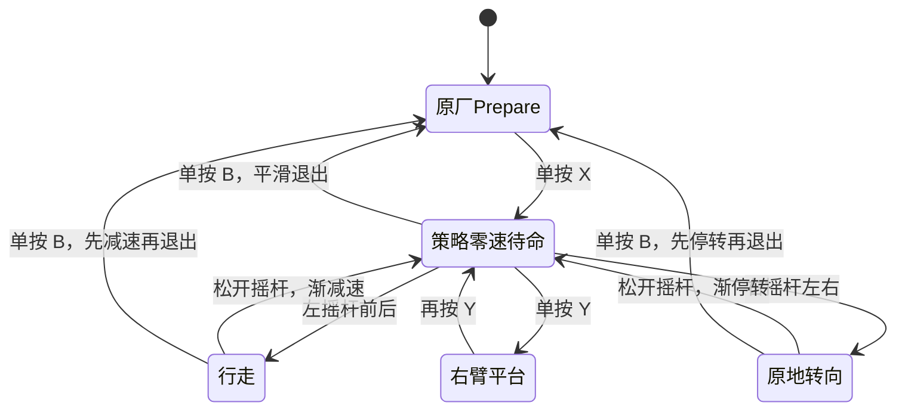

# T1 现场部署唯一入口

更新日期：2026-10-09。

本目录只保留下一次现场要用的程序包、校验文件和这份说明：

- `T1_FIELD_READY_CANDIDATE_20261009.zip`：完整控制器、当前模型、配置和离线测试。
- `T1_FIELD_READY_CANDIDATE_20261009.sha256`：压缩包 SHA256。
- `REVIEW_20261008.md`：10 月 7 日调试复盘，仅用于追溯。

压缩包中的当前模型为 `StopOnlyWarm S55` 第 800 轮，输入 80 维、输出 21 个动作，控制器映射到 T1 的 23 个串行关节。TorchScript SHA256：`75e5772c27f61b857eb387dfaf2eaf50159c884ee3ad0513921afb2ca2f445f6`。固定 1.6 m/s 的 60 秒仿真结果为：实速 1.476 m/s、横漂 +0.039 m、力矩请求触限 3.7%；零速质心高度 0.661 m、平均膝角 0.270 rad。四向 10/20/30/40 N、持续 1 秒的零速推扰测试合计存活 127/128。

## 手柄逻辑

- `X`：一次进入 Custom，立即运行当前模型的零速策略。控制器用 1.5 秒从现有关节目标平滑接管；零速姿态稳定后才开放摇杆。
- `A`：当前任务不使用。
- 左摇杆前后控制前进和后退，右摇杆左右控制原地转向及行进中修正。松杆继续留在 Custom 的策略零速姿态。
- `Y`：独立切换右臂向前平抬动作。它只改右肩俯仰关节，不切换模式，也不启动步态。右臂在有效速度不高于 0.08 时，以 0.9 rad/s 从策略目标平滑抬到 −1.57 rad；行走时恢复策略控制，停下后按键状态仍保留。
- `B`：把命令平滑降到零，稳定后回原厂 Prepare；同一常驻服务随后重新等待下一次 `X`。
- 原厂组合键保留。按着 `LT` 或 `RT` 时，程序不会把 `X/A/B/Y` 当成自定义单键。

右臂动作使用 T1 公开的 23 关节接口。仓库内官方 SDK 示例用 `kRightShoulderPitch = -1.57 rad` 实现右臂向前平抬 90°，因此不需要训练单独动作。

## 程序检查

- 当前 `.pth` 与导出的 TorchScript 在三组 80 维输入上的 21 维输出逐元素一致。
- 单键策略接管、零速姿态门、加减速、松杆留在 Custom、B 退出后重新待命均有离线检查。
- Y 使用上升沿触发，长按不会重复切换；ROS 手柄话题按标准 A/B/X/Y 顺序读取。
- 右臂目标使用关节名查找，不依赖硬编码的电机序号；目标和按键均与步态状态分离。

## 当前训练

S57 从 S55Warm800 分出两组，正在补齐视频里仍能看到的问题：零速轻微右歪、行走大腿内收、低重心原地转向和更强四向抗扰。GPU1 使用温和髋监督与 18 N 扰动，GPU3 使用较强髋监督与 25 N 扰动；两组各训练 1600 轮。S57 只有同时守住速度、横漂、力矩触限和存活率，才会替换本包中的 S55Warm800。

## 现场执行

1. 校验 ZIP 的 SHA256，解压到感知板。
2. 运行包内三个离线检查：`validate_remote_arm_button.py`、`validate_s46_stop_offline.py` 和 `validate_zero_policy_stance_gate.py`。
3. 停掉旧的自定义步态服务，按包内服务文件启动唯一一份控制器。
4. 机器人处于原厂 Prepare 后，按上图一次连续完成零速待命、前进、后退、左右转向、松杆再启动、Y 抬臂和 B 退出。

固件 v1.8.0.9 和新 T1 已跑通过 80→21→23 的实机链路。10 月 9 日新增的单键接管、S55Warm800 和 Y 抬臂尚未在真机复测，首次测试要保留人工扶持和机身急停。
