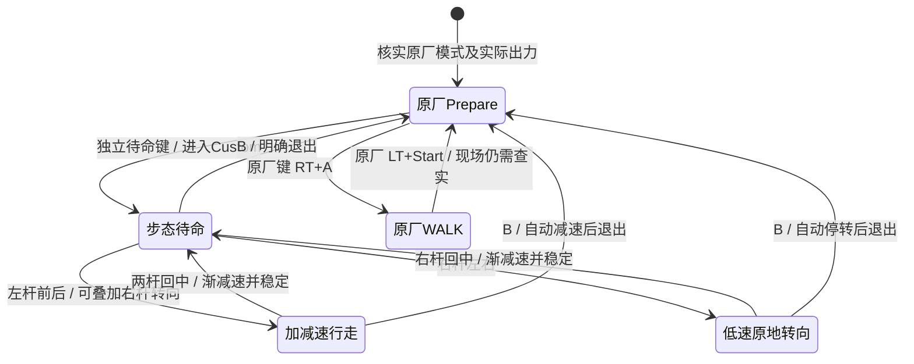

# 10 月 7 日 T1 实机调试复盘

## 结论

这次主要耽误在控制器交互和接管逻辑，不能把每次失稳都归因于模型。新机上的 S46 确实走出过一段，说明 80 维观察、21 动作到 23 个关节目标的链路能够工作；但零速待命、松杆停车、原地转向、反向行走和重复进入都没有完成连续验收。旧机左肩线束故障和后来的电池松脱、手柄关机是另外的故障源。脚下绊步的物理原因尚未从接触数据确认。

## 已核实的程序问题

1. **松杆被当成退出。**旧控制器在前进或转向命令归零后自动交回原厂 Prepare。当时机身仍可能有偏航或前冲角速度，策略尚未稳定；这一切换既掩盖了零速鲁棒性，也让程序退出。最后一版已将 `auto_prepare_on_stop` 设为 `False`，但改完后的整套手柄流程尚未实机复测。
2. **B 退出后出现手柄空窗。**B 让整个 `deploy.py` 进程退出，由 systemd 重启，现场约有数秒按键无效。10 月 8 日本机代码改为只有 B 正常交回 Prepare 后在同一服务进程重新待命；异常退出不自动接管。只通过语法检查和离线策略检查，未部署到机器人。
3. **按键语义没有隔离。**原厂键位依版本变化；原厂手册把 `LT+Start` 定为 Prepare、`RT+A` 定为 WALK，WALK 中单按 `X/A/B` 又可能是动作键。昨天连续按 X→A，是直接沿用 Booster Deploy 的两段入口：X 切 Custom 并保持姿态，A 才启动任务策略；这不是 S46 模型的要求。自定义程序用 B 退出，却未先把“当前实际模式”和原厂按键优先级讲清楚。手臂在按 X 时动作，不能直接解释成 S46 模型自动抬手。本机代码现屏蔽 `LT/RT` 组合下对 X/A/B 的自定义触发；仍需在具体手柄、固件上验证。
4. **零速姿态不是低重心步态待命。**当前适配器在速度命令归零后把模型目标混合回官方 `Prepare` 关节位置与增益。它不是训练出来的抗扰动站姿，不能通过“高重心慢慢站起”证明步态稳定，也不能把原厂 Prepare 当作步态内部停车状态。
5. **可观测性不足。**Custom 内里程计在部分实测段恒为零，不能用它判断真实停稳。需要同一条持久日志记录原始摇杆、过滤后命令、实际模式、IMU、左右脚接触、关节目标与反馈、退出原因。行走时拔掉电脑网线不应影响机器人上的常驻控制；但过去每次故障后依赖 SSH 读日志才能恢复操作，说明手柄状态机没有做好。

现场记录和原始日志在本地 `RL训练/incidents/20261007/`；S46 本机适配器在 `RL训练/booster_deploy_s46/`。新机 SN 尾号 0034、双板 v1.8.0.9；离场后的机器模式、服务状态和程序版本没有重新核验。

## 目标交互状态机

这里的“独立待命键”应只负责进入自定义步态待命；进入后摇杆立即可用，不再叠加 A 二次启动，也不触发抬手。松杆留在低重心待命；B 无论从行走、转向还是待命按下，都只按一次，控制器减速后回原厂 Prepare，不要求人再按一个“停稳键”。原厂手册将 `LT+Start` 定为回 Prepare；现场至少有一次按键已记入 `RemoteController.log`，但机身急停标志仍为 1，所以按键不会恢复关节出力。其他无响应片段没有完整证据证明同一原因，不能把 `LT+Start` 当成当前自定义程序已验证的恢复通道。`LT+Back`、`RT+A` 保持原厂语义。不能在尚未确认空闲单键及其 `/remote_controller_state` 事件之前宣称具体键位已经落实。现行程序仍是 `X→A`，与图示目标有差距。独立抬手动作应在停稳后另用已核实的空闲键和独立状态执行，不与步态待命或行进自动绑定。

急停只处理失稳或硬件故障，不作为正常退出按钮。急停复位后要同时确认机身按钮已弹起、原厂实际出力和模式；RPC 返回 Prepare 不能替代现场姿态确认。

## 训练需要改什么

| 目标 | 现有证据 | 下一版改法与验收 |
| --- | --- | --- |
| 平稳加减速与松杆停车 | 实机前进加速度上限 0.5 m/s²、jerk 1.5 m/s³；程序还会将零速目标混到高站姿。训练随机命令主要每 30–35 秒重采样，不足以覆盖频繁手柄起停。 | 训练中加入前进、反向、转向到零的连续命令课程，随机斜率和停留时长；评估松杆后位移、俯仰/横滚、是否继续迈步、二次前进成功率。限速曲线作为输入整形保留，但不能独自解决姿态。 |
| 零速低重心待命 | `still_proportion=0.1`，`base_height_target=0.68 m`；当前零速目标被混回原厂 Prepare。 | 训练明确的低速/零速待命分布与抗推扰，给待命高度、双脚着地、足底压力和恢复步留足奖励；在同一策略内衔接行走与待命，或训练经验证的独立待命策略。必须实测，不能直接把髋膝目标硬改低。 |
| 低重心转向与后退 | S46 训练有后退及原地转向样本，采样权重各约 12%；实机转向出现后倾，未完成后退连续测试。 | 增加原地左右转和前进中小幅纠偏、后退与停转课程；转向单独评估机身高度、俯仰、旋转响应、松杆余转、抗扰和回待命成功率。 |
| 双脚间距与绊脚 | 当前脚距参考 0.20 m，惩罚幅度截断在 0.20 m；只看脚中心横向距离。摆腿奖励仅在中摆期检查脚是否离地。 | 奖励摆腿全程脚尖、脚跟相对地面高度，惩罚早期落地和异常碰撞；约束两脚包络最小间隙与交叉步，增加小高度地形、摩擦、执行器迟滞随机化。不能一味增大脚距，否则可能损失速度、力矩裕量和转向。用相同种子的直行/转向/起停和不同脚距分位数验收。 |

Isaac Gym 已有三角网格地形和物理接触；当前训练确实使用 `trimesh` 及随机高度，但现有奖励没有专门记录“摆腿脚尖蹭地后绊倒”的事件。因此**可以模拟并训练规避**，先要把脚尖/脚跟离地高度、接触冲量与失败前 0.5 秒轨迹记下来，确认究竟是地面擦碰、双脚互绊、踝部出力不足还是实机间隙/标定差异。`self_collisions: 0` 只是碰撞过滤参数，不能当作已经验证了两脚互碰。仿真通过后仍要在实机确认地面、鞋底、关节响应和两机差异。

## 下次现场一小时的完成定义

**出发前完成**：新策略若涉及低重心待命须先在仿真通过直行、后退、左右原地转、前进中转向、起停和受扰测试；控制器与模型打成唯一版本，核对哈希，独立手柄按键和恢复逻辑离线测试；原厂恢复路径、持久日志和开机服务检查写进同一入口。不能把本机尚未实机验证的代码称作可直接部署成品。

**现场只做一次接入，然后连续人工试车**：0–10 分钟核对机器身份、固件、模式、手柄原始轴/键位和服务版本；10–20 分钟进入待命并重复“前进→松杆→再前进”，不每次退出或等 SSH；20–40 分钟完成后退、左右原地转、前进中转向、回中抗扰；40–60 分钟核对 B 返回待命/Prepare、原厂键仍有效，取一份完整日志和短视频。现场出现明确硬件故障时停在原厂状态，留下已完成项与故障证据；不通过不断更换测试程序来继续试。

**资料依据**：[Booster T1 手柄操作](https://docs.booster.tech/zh-CN/docs/product-manual/t1/basic-operations/joystick-control/)、[Booster Deploy 官方框架](https://github.com/BoosterRobotics/booster_deploy)、[Isaac Gym 地形与碰撞](https://docs.robotsfan.com/isaacgym/programming/simsetup.html)、[Isaac Lab 接触奖励](https://isaac-sim.github.io/IsaacLab/develop/source/api/lab/isaaclab.envs.mdp.html)。
